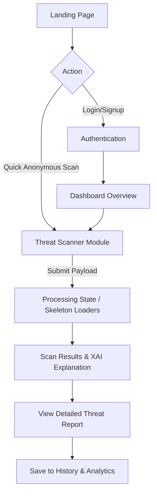
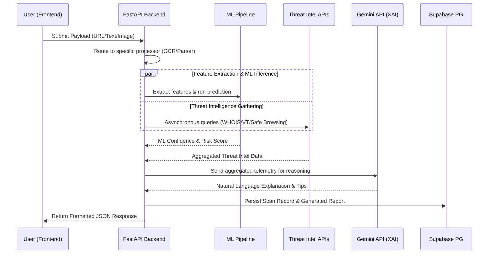
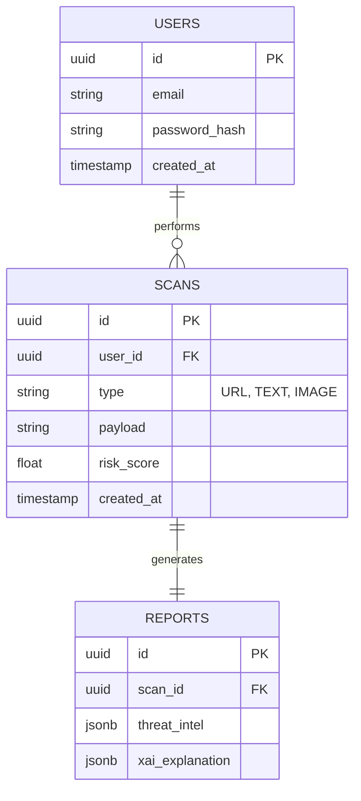
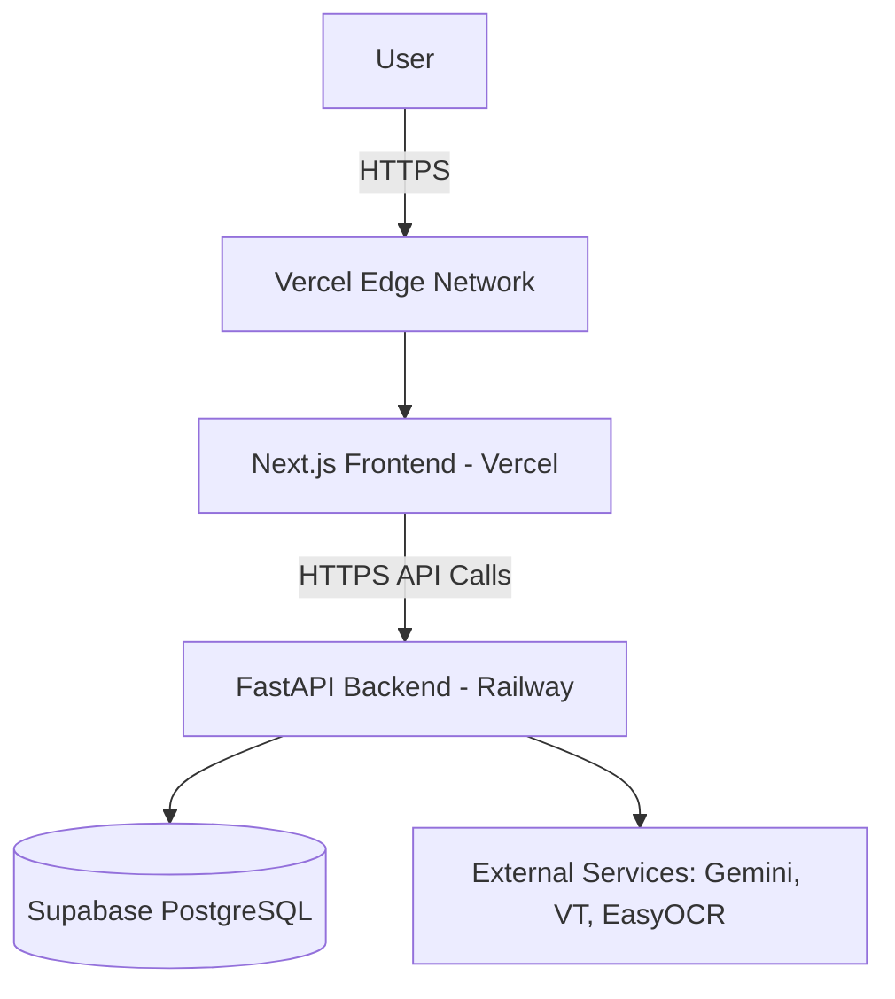

# PhishGuard XAI - Software Architecture Document

> **Tagline:** Detect. Explain. Prevent.

---

## 1. Project Vision
To build a scalable, AI-powered Zero-Day Phishing Intelligence Platform that not only detects multi-vector phishing attacks in real-time but also comprehensively explains the reasoning behind its decisions. PhishGuard XAI aims to empower users and organizations with actionable threat intelligence, demystifying cybersecurity through Explainable AI.

## 2. Problem Statement
Phishing attacks are evolving rapidly, utilizing multi-channel vectors (URLs, emails, SMS, WhatsApp, QR codes) and zero-day techniques that easily evade traditional signature-based detection. Furthermore, existing security tools often act as impenetrable "black boxes," providing binary "Safe/Unsafe" verdicts with no understandable reasoning for end-users, leading to user mistrust, alert fatigue, and continued vulnerability.

## 3. Solution Overview
PhishGuard XAI is a comprehensive, multi-modal threat detection platform designed to analyze URLs, raw text, images (screenshots, QR codes), and ultimately documents. By orchestrating a synergy of traditional machine learning (Random Forest), external Threat Intelligence, and advanced Large Language Model (LLM) reasoning via the Gemini API, the platform detects zero-day threats and translates complex security telemetry into human-readable explanations, risk scores, and practical prevention tips.

## 4. Unique Selling Points
- **Omni-Channel Analysis:** Seamlessly scans URLs, Emails, SMS, WhatsApp snippets, QR Codes, and Visual Screenshots.
- **Explainable AI (XAI):** Moves beyond basic detection to explain *why* an artifact is malicious using LLM-driven reasoning.
- **Zero-Day Resilience:** Combines heuristic ML models and contextual AI to catch novel threats before they are blacklisted.
- **Premium User Experience:** A stunning, glassmorphism-themed, single-pane-of-glass dashboard that redefines security UX.
- **Enterprise-Grade Foundation:** Built with a scalable architecture that bridges rapid hackathon deployment with production readiness.

## 5. Target Users
- **Everyday Consumers:** Individuals seeking to verify suspicious links, SMS messages, or QR codes before interacting.
- **Security Analysts (SOC Teams):** Professionals requiring rapid triage, enriched context, and XAI insights for incident response.
- **Enterprise IT Departments:** Teams monitoring internal threat landscapes and educating employees through real-time feedback.

## 6. System Requirements
- **Frontend:** Modern web browser (Chrome, Edge, Firefox, Safari) supporting ES6 and WebGL (for framer-motion animations).
- **Backend:** Python 3.10+, minimum 2GB RAM for memory-resident OCR and ML processing, outbound internet access for API orchestration.
- **Database:** PostgreSQL 15+ (hosted on Supabase) for relational integrity and fast JSONB queries.

## 7. Complete Feature List
- Universal Threat Scanner (URL, Text, Image, QR).
- Real-time Risk Score & Confidence Scoring algorithms.
- Natural Language XAI Explainability Engine.
- Real-time Threat Intelligence Aggregation (VirusTotal, PhishTank, WHOIS).
- Visual Analytics Dashboard with Threat History.
- Downloadable / Exportable PDF Threat Reports.
- Dark Mode & Premium Glassmorphism UI components.
- Responsive Mobile-First Design.

## 8. Functional Requirements
- The system must accept and process inputs in the form of URLs, raw text, or uploaded image files.
- The system must query and aggregate data from external Threat Intel APIs asynchronously.
- The system must extract parseable text from images utilizing integrated OCR engines.
- The system must compute and return a normalized risk score (0-100) and an ML confidence score.
- The system must generate an AI explanation for every scan using the LLM pipeline.
- The system must securely persist scan history and generate reports tied to user accounts.

## 9. Non Functional Requirements
- **Latency:** Scan results (excluding uncontrollable external API delays) should be processed and returned within 5-7 seconds.
- **Availability:** Ensure 99.9% uptime, especially critical during the hackathon judging and demo phase.
- **Security:** All data in transit must be encrypted (HTTPS/TLS), API rate limits strictly enforced, and endpoints secured via JWT.
- **Scalability:** Stateless backend design capable of horizontal scaling and connection pooling.
- **Usability:** 60 FPS UI animations, strict adherence to the defined design system, and accessible (WCAG compliant) interfaces.

---

## 10. User Flow



## 11. Complete Information Flow



---

## 12. Frontend Architecture
- **Framework:** Next.js 15 (App Router for optimized server/client rendering).
- **Core Library:** React 19 with strict TypeScript typing.
- **State Management:** React Context + Zustand (global UI state), React Query (server state & caching).
- **Styling:** Tailwind CSS combined with custom CSS variables for complex Glassmorphism effects.
- **Component Library:** Shadcn UI (leveraging Radix UI primitives for accessibility).
- **Forms & Validation:** React Hook Form coupled with Zod for robust client-side validation.
- **Animations:** Framer Motion for sophisticated page transitions, micro-interactions, and layout animations.
- **Data Visualization:** Chart.js for dashboard analytics.

## 13. Backend Architecture
- **Framework:** FastAPI (Asynchronous Python for high concurrency).
- **Architecture Style:** Clean Architecture enforcing SOLID principles.
- **Structure:** Modular design separating Routing, Service Layer, and Data Access logic.
- **Validation:** Pydantic V2 models for strict I/O validation and serialization.
- **ORM:** SQLAlchemy 2.0 (Async mode) for database interactions.
- **Dependency Injection:** Utilizing FastAPI's `Depends` for managing DB sessions, auth contexts, and external service clients.

## 14. Machine Learning Architecture
- **Core Model:** Random Forest Classifier, chosen for its balance of accuracy and feature importance interpretability.
- **Training Context:** Pre-trained on extensive datasets of phishing URLs and malicious SMS/Email text.
- **Pipeline:** 
  1. Input Vectorization (TF-IDF for text bodies, structural heuristics for URLs).
  2. Inference via `scikit-learn`.
  3. Probability score extraction (Confidence Index).
- **Deployment Strategy:** Pickled model loaded into memory on FastAPI startup to minimize inference latency.

## 15. Explainable AI Pipeline
- **Reasoning Engine:** Google Gemini API.
- **Prompt Engineering:** Dynamically constructs prompts aggregating ML outputs, Threat Intel telemetry, and raw inputs.
- **Structured Output:** Enforces a rigid JSON schema response from Gemini containing: `threat_category`, `reasoning_steps`, `user_advice`, and `severity_assessment`.

## 16. Threat Intelligence Pipeline
- Orchestrates highly concurrent asynchronous HTTP calls to:
  - **WHOIS:** For domain age, registrar reputation, and expiration data.
  - **VirusTotal API:** For hash/URL community reputation and engine detections.
  - **PhishTank API:** Checking against known, active phishing URL databases.
  - **Google Safe Browsing API:** Real-time threat lists.

## 17. OCR Pipeline
- **Primary Engine:** EasyOCR (Deep learning based, superior accuracy for diverse fonts).
- **Fallback Engine:** Tesseract (Fast, traditional OCR).
- **Process:** Image normalization -> Grayscale conversion -> Text Extraction.
- **Output:** Raw string data piped into the Text/Email Analysis Pipelines.

## 18. QR Analysis Pipeline
- **Engine:** `pyzbar` or OpenCV (`cv2`).
- **Process:** Rapidly decode QR code matrix -> Extract embedded payload (URL/Text) -> Feed seamlessly into the respective Scanner pipeline.

## 19. Email Analysis Pipeline
- **Parsing Logic:** Deconstructs email headers, sender domain, reply-to addresses, and body content.
- **Analysis:** Validates SPF/DKIM/DMARC alignment (if raw EML provided), analyzes urgency keyword density, and extracts embedded links for recursive URL analysis.

## 20. URL Feature Extraction Pipeline
- Extracts critical heuristics including: String length, presence of raw IP addresses, special character anomalies (`@`, `-`), abnormal subdomains, HTTPS validation, use of URL shortening services, and Levenshtein distance calculations to spoofed top brands.

## 21. AI Reasoning Pipeline

```mermaid
graph LR
    A[Aggregated Telemetry (ML + TI)] --> B[Contextual Prompt Builder]
    B --> C[Gemini API]
    C --> D[XAI JSON Output Parser]
    D --> E[Final API Response Payload]
```

## 22. Authentication Architecture
- **Mechanism:** JWT (JSON Web Tokens) stored in HTTP-only, secure cookies to mitigate XSS vulnerabilities.
- **Flow:** Next.js Server Actions manage the authentication flow -> FastAPI backend verifies credentials and issues tokens.
- **Security:** Argon2 or Bcrypt for password hashing.

## 23. Database Design
- **Engine:** PostgreSQL (Hosted via Supabase).
- **Philosophy:** Highly normalized relational tables for core entities (Users, Scans), utilizing `JSONB` columns for flexible storage of variable Threat Intel and XAI outputs.

## 24. ER Diagram



## 25. Database Schema
- **`users`**: `id` (UUID), `email` (String, Unique), `hashed_password` (String), `is_active` (Boolean), `created_at` (Timestamp).
- **`scans`**: `id` (UUID), `user_id` (UUID, FK), `type` (Enum), `raw_input` (Text), `risk_score` (Float), `confidence` (Float), `status` (String), `created_at` (Timestamp).
- **`reports`**: `id` (UUID), `scan_id` (UUID, FK), `ml_results` (JSONB), `threat_intel_results` (JSONB), `ai_explanation` (Text), `recommended_action` (Text).

## 26. Folder Structure

```text
/phishGuard-Xai
├── /frontend                      # Next.js Application
│   ├── /src
│   │   ├── /app                   # App Router pages (/, /dashboard, /scanner)
│   │   ├── /components            # UI, Forms, Layouts (Shadcn + Custom Glassmorphism)
│   │   ├── /lib                   # Utilities, API clients, Zod schemas
│   │   ├── /store                 # Zustand global state
│   │   ├── /types                 # TypeScript interfaces
│   │   └── /styles                # Tailwind config & global CSS
├── /backend                       # FastAPI Application
│   ├── /app
│   │   ├── /api                   # API Routes (/v1/scan, /v1/auth)
│   │   ├── /core                  # Config, Security, JWT logic
│   │   ├── /models                # SQLAlchemy Models
│   │   ├── /schemas               # Pydantic Schemas (Request/Response)
│   │   ├── /services              # Business Logic (Pipelines, External API wrappers)
│   │   ├── /ml                    # Pickled models, Feature extractors
│   │   └── /utils                 # Helpers, loggers
```

## 27. REST API Design
- Adheres strictly to RESTful resource-oriented principles.
- Uniform JSON payloads for all requests and responses.
- Implementation of standard error responses utilizing RFC 7807 (Problem Details for HTTP APIs).

## 28. API Endpoints
- `POST /api/v1/auth/register`
- `POST /api/v1/auth/login`
- `GET /api/v1/auth/me`
- `POST /api/v1/scan/url`
- `POST /api/v1/scan/text`
- `POST /api/v1/scan/file` (Handles Images/QR via multipart/form-data)
- `GET /api/v1/scans` (History with pagination)
- `GET /api/v1/scans/{id}`

## 29. Request & Response Formats
**Example Scan Response Payload:**
```json
{
  "scan_id": "a1b2c3d4-...",
  "status": "success",
  "data": {
    "risk_score": 88.5,
    "confidence": 94.2,
    "threat_level": "CRITICAL",
    "threat_category": "Credential Harvesting",
    "xai_explanation": "The submitted URL attempts to visually mimic a Microsoft login page, however, the domain was registered only 2 days ago. Additionally, structural analysis reveals hidden iframes designed to capture keystrokes.",
    "prevention_tips": [
      "Do not enter any credentials on this page.",
      "Block the sender domain in your email gateway.",
      "Report the URL to your IT department."
    ]
  }
}
```

## 30. Error Handling Strategy
- **Backend:** Global exception handlers in FastAPI intercept errors and format them into standard `{"error": "description", "code": "STATUS_CODE"}` responses.
- **Frontend:** React Error Boundaries catch fatal render errors. Toast notifications display API failures gracefully. Zod provides inline, localized form field errors.

## 31. Logging Architecture
- **Backend:** Centralized Python `logging` module configuration. Output to console with rich formatting during development; structured JSON formatting for production environments.
- **Levels:** `INFO` for standard requests, `WARN` for ML/Intel API latency or timeouts, `ERROR` for system exceptions.

## 32. Monitoring Architecture
- **Frontend/Backend Error Tracking:** Integration ready for Sentry to capture unhandled exceptions.
- **Performance:** FastAPI instrumentation utilizing middleware to track basic metrics like endpoint response times and request volume.

## 33. Caching Strategy
- **Application Level:** In-memory LRU cache (or optional Redis if time permits) to cache identical URL scans for a 24-hour window, drastically reducing external API quota usage and accelerating response times.

## 34. Security Architecture
- **CORS:** Strict origin policies allowing only the Vercel frontend URL.
- **Headers:** Implementation of strict security headers (e.g., Content-Security-Policy, HSTS) via Next.js config and FastAPI middleware.
- **Data Safety:** Complete parameterization via SQLAlchemy to eliminate SQL injection risks. Secrets managed strictly via environment variables.

## 35. Rate Limiting
- Implementation of FastAPI `slowapi` to enforce rate limits per IP (e.g., 10 scans/minute) to prevent malicious abuse of the platform and protect Gemini/Threat Intel API quotas.

## 36. Input Validation
- **Backend:** All endpoints protected by exhaustive Pydantic schemas validating type, length, and format.
- **Frontend/Uploads:** File uploads strictly restricted by size (< 5MB) and mime-type (`image/jpeg`, `image/png`).

## 37. Deployment Architecture



## 38. Scalability Strategy
- Highly stateless backend design allows effortless horizontal scaling on platforms like Railway.
- Database connection pooling managed natively by Supabase pgBouncer to handle concurrent high-volume traffic.

## 39. Performance Optimization
- Lazy loading for heavy frontend components (Chart.js, complex Framer animations).
- Truly asynchronous backend operations ensuring external API queries never block the event loop.
- Next.js `<Image>` component utilization for optimized asset delivery.

## 40. Mobile Responsive Design Strategy
- Strict mobile-first design approach using Tailwind's responsive breakpoints (`sm`, `md`, `lg`).
- Adaptive navigation (hamburger menus for mobile, sidebars for desktop).
- UI elements like scan results elegantly reflow into stacked cards on smaller viewports.

## 41. Accessibility Guidelines
- Adherence to WCAG 2.1 AA standards.
- Semantic HTML and proper ARIA labeling on all custom interactive elements (facilitated largely by Shadcn UI).
- Robust keyboard navigability and focus management.
- High contrast considerations embedded within the bespoke Dark Mode theme.

## 42. Component Hierarchy
- `RootLayout` (Integrates ThemeProvider, AuthProvider)
  - `Navbar` (Global actions)
  - `Sidebar` (Dashboard navigation)
  - `PageContainer` (Layout wrapper)
    - `ScannerTabs` (Switcher for URL | Text | Image)
      - `UploadDropzone` / `TextInputArea`
    - `ResultDashboard`
      - `RiskGaugeComponent`
      - `XAIExplanationCard`
      - `ThreatIntelList`

## 43. Page Wise Breakdown
- `/` - **Landing Page:** High-impact Hero section, feature showcases, premium animations, CTA.
- `/dashboard` - **Dashboard:** Main user interface, aggregate metrics, quick access to tools.
- `/scanner` - **Threat Scanner:** The core utility for analyzing inputs.
- `/history` - **Threat History:** Tabular, filterable view of past scans and generated reports.
- `/settings` - **Settings:** Profile management, API key configurations (future scope), theme toggles.

## 44. Frontend State Management
- **Zustand:** Manages lightweight, global UI state (user session presence, theme preferences, sidebar toggle).
- **React Query:** Exclusively handles server state, data fetching, caching, and loading/error states for scan requests and history retrieval.

## 45. Backend Services
- `ScanService`: The core orchestrator managing the ML, Threat Intel, and XAI pipelines concurrently.
- `AuthService`: Handles all logic related to user registration, authentication, and JWT lifecycle.
- `ThreatIntelService`: Robust wrappers around external APIs (VirusTotal, WHOIS) with built-in retry and timeout logic.

## 46. Background Jobs
- *Hackathon MVP:* Background processing handled synchronously or via fast async tasks.
- *Future Ready:* Architecture designed to easily integrate `Celery` or FastAPI `BackgroundTasks` for extremely heavy OCR/ML processing to avoid HTTP timeouts.

## 47. Future Scope
- Real-time Browser Extension for passive URL scanning.
- Slack/Discord Bot integrations for community protection.
- Enterprise API access offering B2B Threat Intelligence feeds.
- Advanced Document Analysis (e.g., detecting malicious macros in PDFs and Office documents).

## 48. Hackathon Demo Flow
1. **The Hook:** Present a real-world, deceptive phishing SMS or QR code.
2. **The Action:** Live paste the payload into PhishGuard XAI.
3. **The Wow Moment:** Showcase the premium glassmorphism loaders transitioning into a plain-English, deeply insightful explanation (XAI) of the threat.
4. **The Deep Dive:** Expand the technical breakdown (WHOIS data, ML confidence scores) to satisfy technical judges.
5. **The Conclusion:** Display the dashboard aggregating these threats, proving enterprise readiness.

## 49. Presentation Strategy
- Emphasize the **"Explain"** differentiator. Many tools can detect; very few can explain *why* in human terms.
- Highlight the **Premium UI/UX**. Cybersecurity tools are notoriously clunky; PhishGuard is designed to be stunning and intuitive.
- Focus on the modern tech stack and the platform's capability to detect zero-day threats without relying solely on outdated blocklists.

## 50. Development Roadmap (48 Hours)
- **Hours 1-4:** Architecture design (Completed), Boilerplate repository setup (Next.js & FastAPI), Database schema deployment to Supabase.
- **Hours 5-12:** Core backend APIs development, establishing mock ML/Intel responses for frontend unblocking.
- **Hours 12-24:** Frontend UI shell creation, Authentication integration, basic Scanner form implementation.
- **Hours 24-36:** Actual ML Model Integration, Gemini API Prompt Tuning, live Threat Intel API connections.
- **Hours 36-42:** UI Polish, Framer Motion animations, comprehensive Error Handling, Mobile Responsive audits.
- **Hours 42-48:** Final Deployment (Vercel/Railway), end-to-end testing, bug squashing, and pitch deck preparation.
